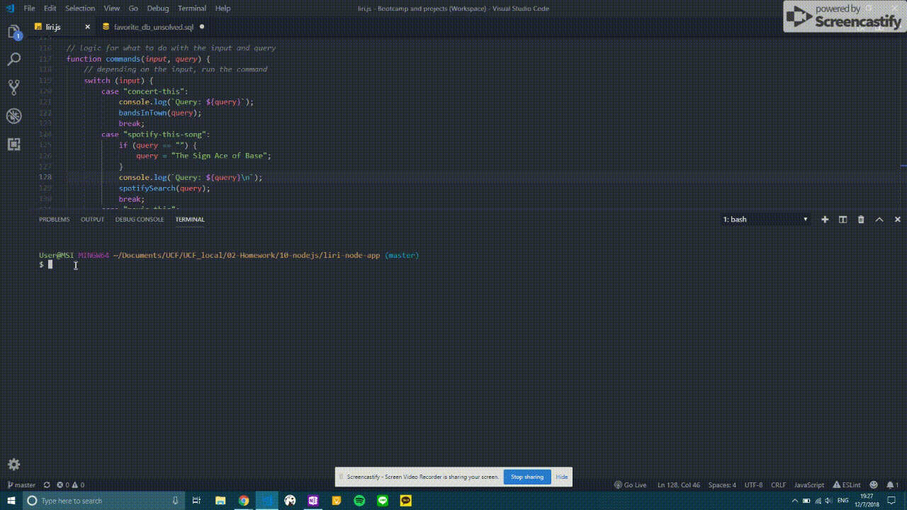
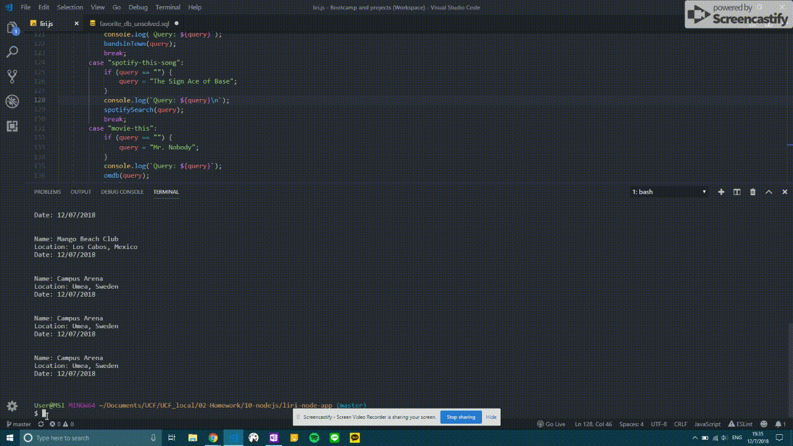
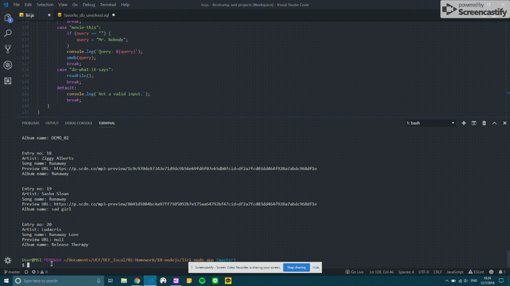

# liri-node-app
A command line node app that takes in parameters and gives you back data. This app accepts input from the user in the form of a command and a query. Depending on the command, it will do different things.

*Example input*
node liri movie-this Avengers

## 4 Possible Commands

### 1. concert-this

### 2. spotify-this-song

### 3. movie-this

### 4. do-what-it-says

